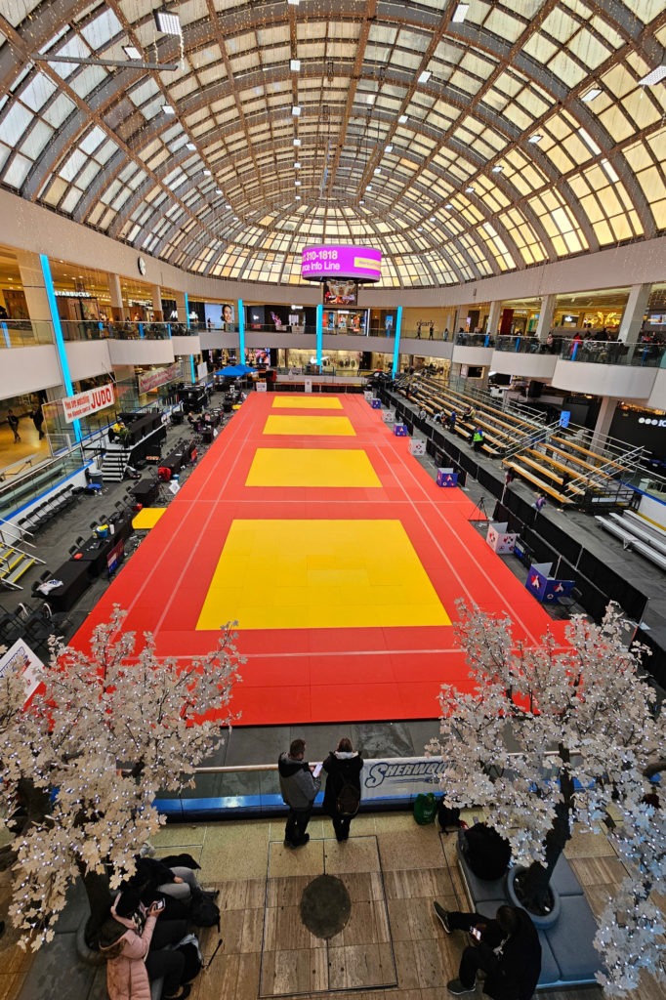

We flew out to Edmonton this past weekend. Arrived Thursday afternoon, got to the rental car place, which was—predictably—out of the compact cars that I rented. For the same price, they gave us a Mustang.

(What a _ridiculous_ car.)

Highlights of the weekend:

- Hanging out with family

- Teaching Gracie to play crib

- Spending 28 hours at the West Edmonton Mall, most of it at the Ice Palace where they set up the judo mats

- Passing my National B referee evaluation

- Pretzels with cinnamon sugar

- A walk with Juliana to see hoodoos in the city

- Seeing Mary at the airport—she was flying out to Edmonton on the same plane we'd just returned on

- Park 'n' Fly washed our car while we were away

As always: it's fun to travel, but it's sure nice to be home. Tomorrow is gonna be laundry day.
