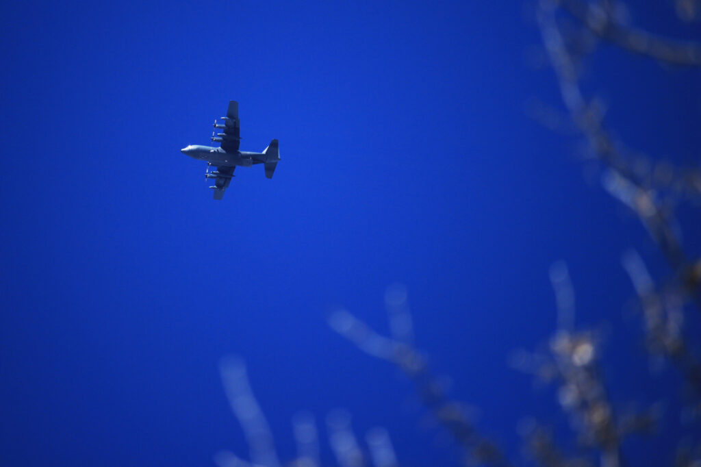

Right around lunch I heard the drone of an airplane, and it sounded different than a Cessna: louder, maybe, or deeper. I put the zoom lens on my camera and stepped outside to see if I could find it.

It looks like a C-130 Hercules was tooling around. I got a couple photos for you to enjoy.

