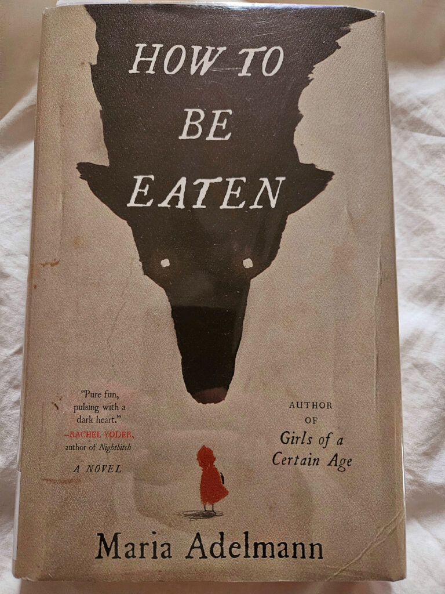
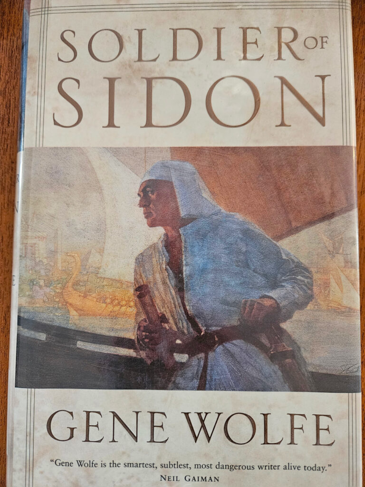

My local library had neither one of these books in the stacks. Enter ILL!

<figure>

<figure>

<figcaption>

A support group for the heroines of fairy tales

</figcaption>

</figure>

<figure>

<figcaption>

The third and final novel in the saga of Latro, amnesiac Roman soldier

</figcaption>

</figure>

</figure>

I bet I could probably get Gene Wolfe's final novel, _Interlibrary Loan_, via ILL...
