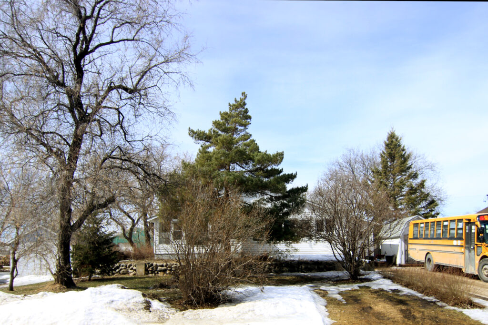
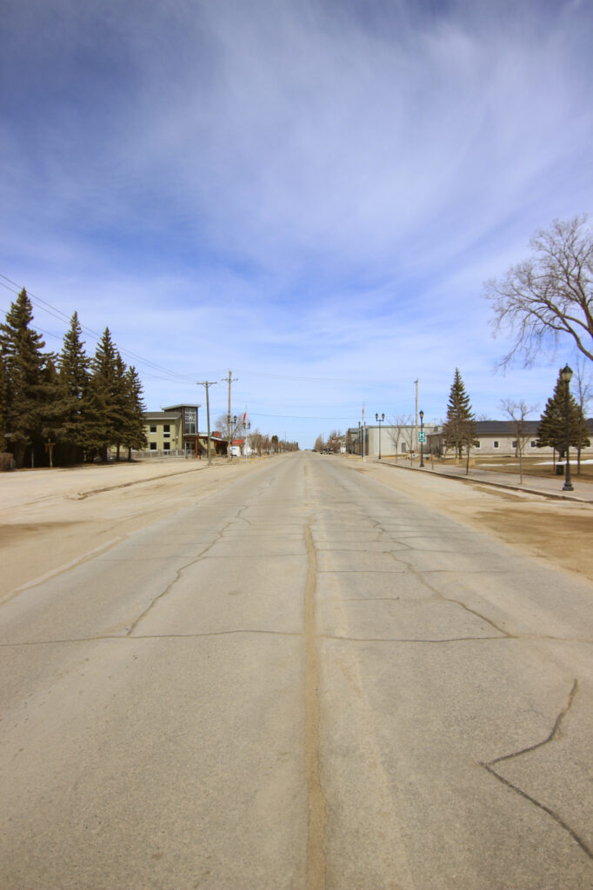
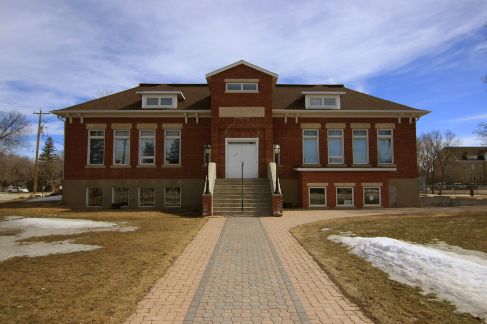
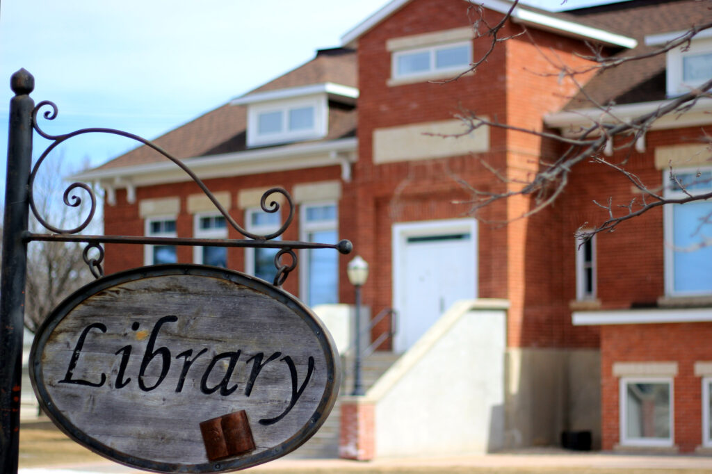
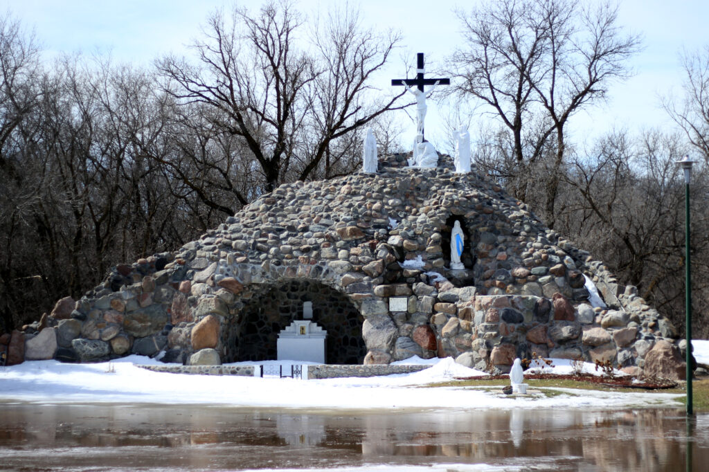
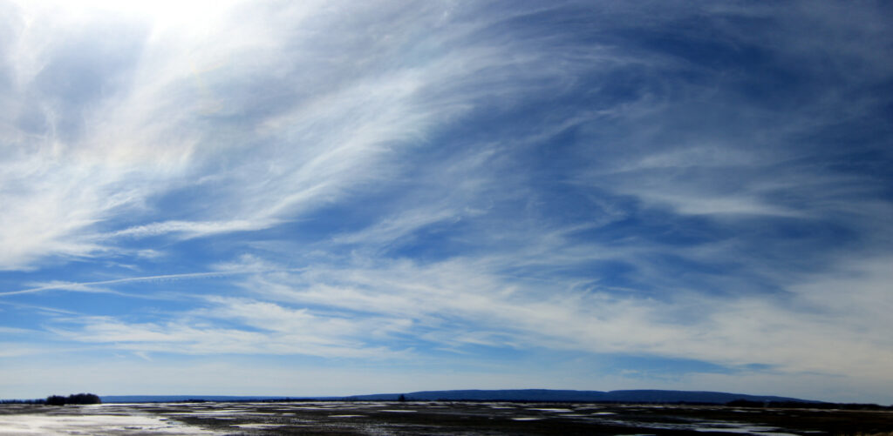
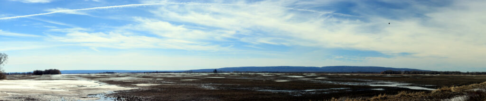

Kathleen had meetings in Dauphin today, so I took a side trip to Ste. Rose to have a look around.

<figure>

<figure>

<figcaption>

I grew up here

</figcaption>

</figure>

<figure>

<figcaption>

Main St (Well, Central Ave)

</figcaption>

</figure>

<figure>

<figcaption>

The library

</figcaption>

</figure>

<figure>

<figcaption>

The library

</figcaption>

</figure>

<figure>

<figcaption>

The grotto, a little flooded

</figcaption>

</figure>

</figure>

It was a little weird driving around in town. It's been a while since I was there, and so there were spots where my mental map differed from reality. There are a row of new condos along where the rail line used to go. The spot where a house once stood (the one I had in mind, in fact, when I wrote the line "a house crumbling into genteel senescence"((whatever _that_ means))) is now a vacant lot. Another house, which in my memory is a pale yellow somewhere between lemon and sunshine, has been re-sided in a dark mossy green.

You can go home, but it's not gonna be the same.

I also got a couple multi-photo panoramas of Riding Mountain when I headed back to Dauphin to pick up my darling wife.

<figure>

<figure>

<figcaption>

4-photo panorama

</figcaption>

</figure>

<figure>

<figcaption>

12-photo panorama

</figcaption>

</figure>

</figure>
