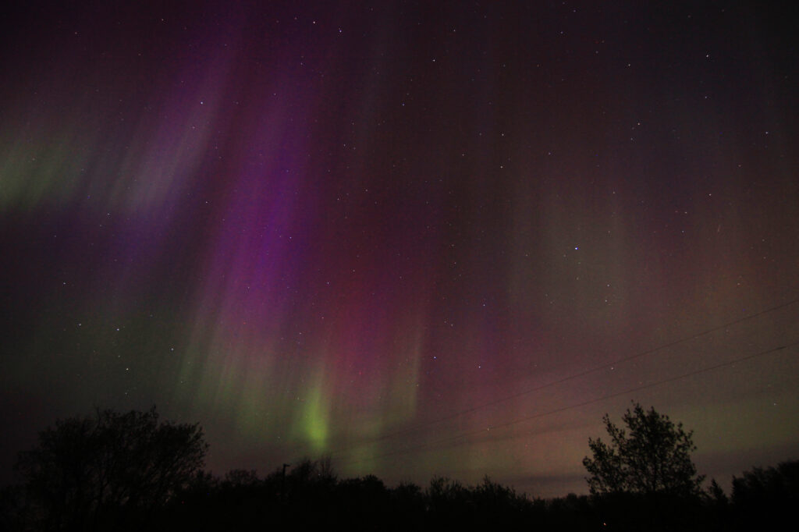
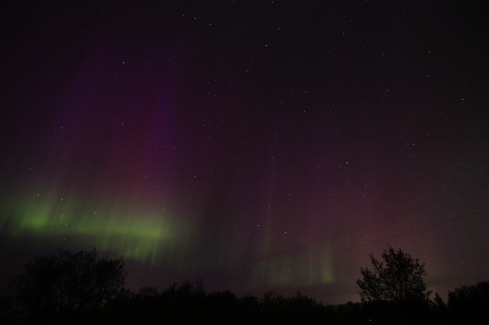

A few days ago, the sun launched like 5 CMEs our way. This naturally excited all the aurora nerds, myself included((I charged all my camera batteries and tried to keep my expectations tempered.)).

CMEs are the usual cause of auroras, and when you get more than one at a time, the aurora show is usually going to be more intense. So when night fell and the data was((were)) still looking intense((The KP index, for example, was between 7 and 9, its maximum; most of the really intense shows I've seen were at KP6 or so)), I packed my gear and headed west of the city to one of the spot I like to use for aurora photos.

I arrived with daylight still fading and started setting up. There was another car nearby; they, too, were there to watch the show.

Here's the first shot I got, unedited except for straightening and cropping. Even in the twilight you can see the purple/pinkish lines of aurora.

<figure>

<figcaption>

The first photo I took upon arriving

</figcaption>

</figure>

As it got dark, the lights got brighter. I had two DSLRs running, and I snapped a few photos with my phone, too. Apparently my new phone has a better camera than the old one, or else it's better at post-processing, because those shots were pretty good if I do say so myself.

I was there from about 10:15pm till just around midnight. My friend Neal came for a visit, and there were about 3 or 4 other cars that showed up on the stretch of road, too.

OK, enough talking; here are the photos. All the DSLR photos were taken at 5 second exposures, apeture _f_/2.8 or _f_/1.8 on the 50mm lens((ie, as wide open as the lenses would shoot)), ISO 1600. The phone photos were taken on night mode, using whatever automatic settings the phone decided would work best.

First up: the DSLRs.

And here are the photos from my phone.

<figure>

<figure>

<figcaption>

Facing south; you can see my cameras on their tripods in front of my car

</figcaption>

</figure>

</figure>

And a couple of time-lapse videos. In each video, 1 second is 1 minute of real time.

https://vimeo.com/945281570

https://vimeo.com/945289337
