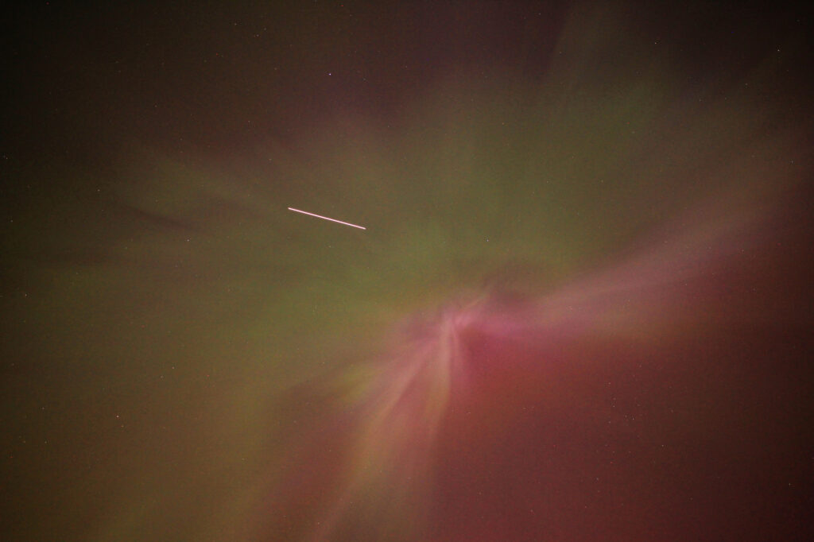
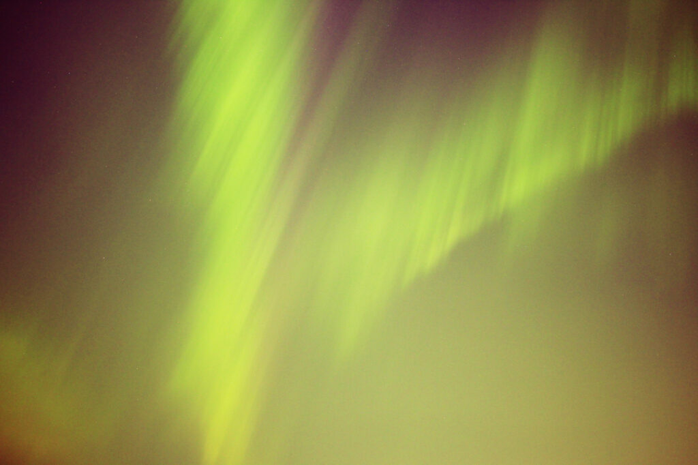
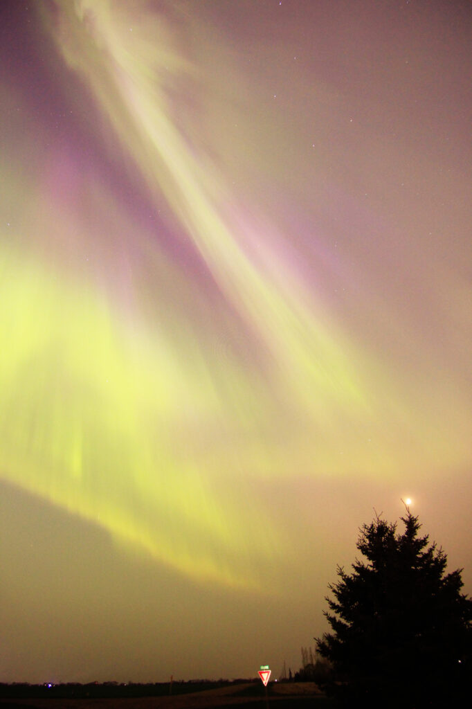

The second night(([First night is here.](https://patrickjohanneson.com/2024/05/11/aurora-borealis-may-10-2024/))) of the show was a bit tamer, and tempered by smoke in the air that amplified all the ground lights. Still, it was a good night. I spent a couple hours snapping photos with my friend Kevin.

<figure>

<figcaption>

Left: unedited; right: colours edited

</figcaption>

</figure>

The smoke turned the crescent moon reddish-orange, too.

Timelapse. See if you can tell when the light was strong enough that I could see it reflecting off my hi-vis vest.

https://vimeo.com/945546739

I was out from about 10:30pm till about half past midnight. It was another good night.
