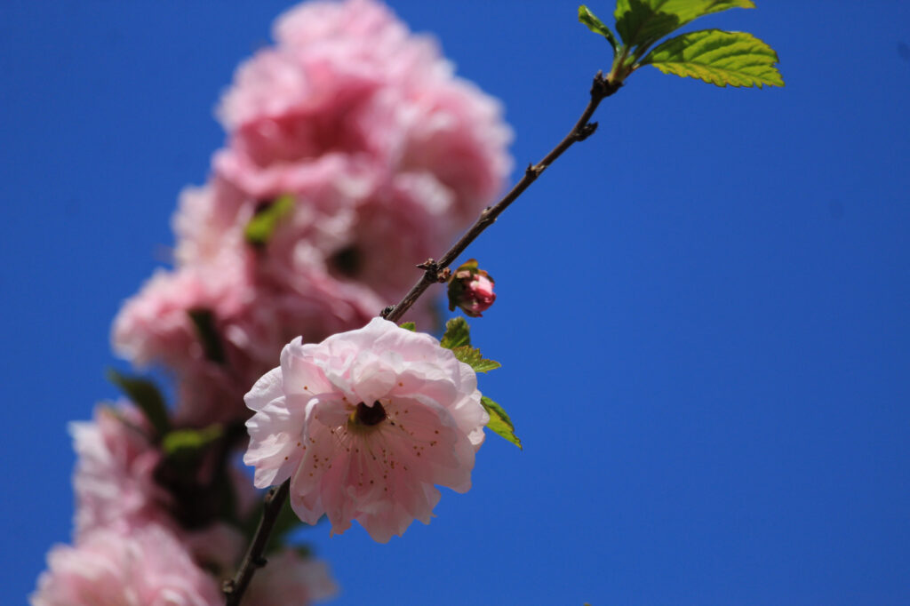

I went about 22km and took a bunch of photos.

The trees were all starting to flower. Even the lilacs had blossoms on them.

You can talk all you want about robins redbreast, but for me the truest sign of spring is when the yellow heads of dandelions((Or, as the French would have it, «pissenlits».)) appear.

I'm glad to see the Ukrainian flag is still hangin' in there at the public gardens, too. I imagine that I'll be photographing sunflowers there later this summer.

