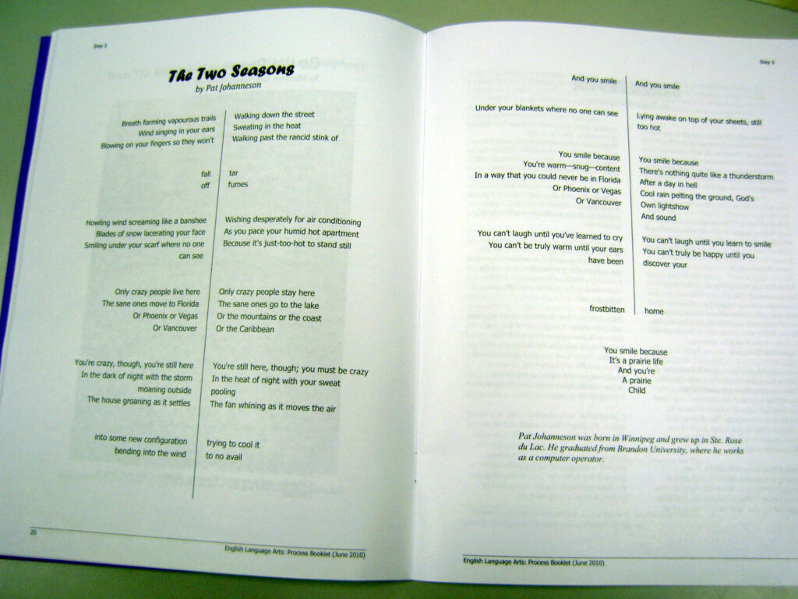
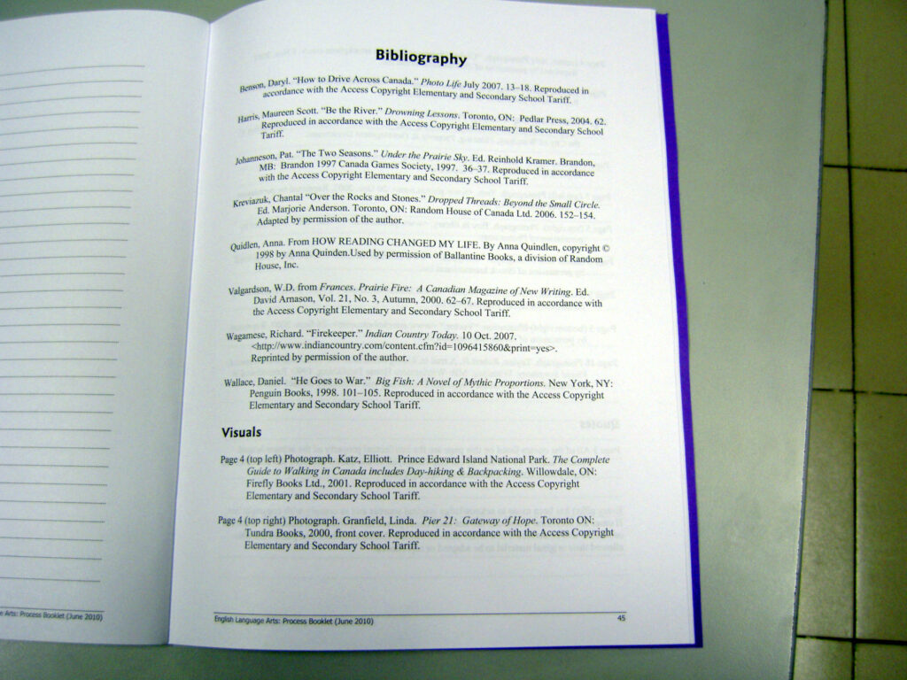

This morning, on the radio, the very first news story I heard was about how the provincial English exam got postponed((Or canceled, who knows.)) because they had, to use Manitoba Education's words, ["an issue regarding necessary permissions to use materials."](https://www.cbc.ca/news/canada/manitoba/manitoba-english-test-postponed-1.7214896 "What a cute euphemism for 'copyright violation'") And I laughed.

<!--more-->

It sounds like they haven't learned about copyright and licensing in, oh, at _least_ 14 years, because they did something like this to me back in 2010. I searched my blog, and found that [I've only tangentially mentioned it](https://patrickjohanneson.com/2015/12/01/access-copyright/ "The post is about Access Copyright"), so here's story as I remember it.

In 1997 the Canada Summer Games were coming to Brandon. Among many other things, the organizers put together an anthology of local writing, titled _Under the Prairie Sky_. I submitted a brief poem, titled "The Two Seasons", and it was accepted for publication.((It remains the highest pay-per-word I've achieved in my writing career.)) The anthology came out and I got a contributor's copy, which is _somewhere_ in my library at the moment. There's also a copy in the Brandon University library.

At the end of May, 2010, my aunt Moe—who was at the time teaching English in a school in China—sent me an email.

> Hi Pat,
> 
> Today was the first day of the grade 12 provincial exam and I happened to be helping with supervision.  So I look into the booklet of readings and I see--"Two Seasons" by youknowwho!!! Quel surpris!!!
> 
> I'm not sure if this means you've made it to the big time--if you're part of the mainstream--if you're in danger of fossilization because an educational 'institution' has recognized your value in analytical thinking.  Or---none of the above--cuz you're just a really good writer and you're work's getting out all over the place.
> 
> It was a cool 'gift' in odd wrapping that had me smiling all day.  Thanks.

My first reaction was "What?" followed quickly by "Oh well, what can I do about this?" I assumed, since Moe was in China, that she was saying my little poem had ended up in a Chinese exam. There's a well-worn stereotype that copyright is routinely violated in China, and I couldn't imagine—even if I'd "made it to the big time"—what kind of power I'd have to seek any redress.

But after a bit of back-and-forth with Moe, it turned out that no, she'd been helping with the _Manitoba_ provincial English exam. I was surprised, because no one reached out to me to ask for permission to reprint my poem.

Apparently Manitoba Education even had a little note in their exam booklet that they thought would absolve them: "Every effort has been made to acknowledge and comply with copyright law. If cases are identified where this has not been done, please notify Manitoba Education. Sincere thanks to the authors and publishers who allowed their original material to be used."

Except they didn't make _any_ effort to reach me. At that point I'd had the same phone number, printed in the phone book under my name, since _at least_ 1997. My work email address, then as now, has been unchanged since 1994. No one reached out to me about this.

I checked the copyright page in _Under the Prairie Sky_, which stated that each piece's copyright was retained by its author. Meanwhile Moe let me know that my poem's bibliography entry in the exam read

> Johanneson, Pat. "The Two Seasons." _Under the Prairie Sky_. Ed. \[redacted\]. Brandon,MB: Brandon 1997 Canada Games Society, 1997. 36-37. Reproduced in accordance with the Access Copyright Elementary and Secondary School Tariff.

...which, if nothing else, pointed me at Access Copyright. It also told me that they might have reached out to the anthology's editor, \[redacted\], who was someone I knew.

I reached out to the editor.

> Did Manitoba Education approach you about the use of a poem from the "Under the Prairie Sky" anthology from the 1997 Canada Games? Specifically, my poem "The Two Seasons"?
> 
> Apparently it's appeared in the Grade 12 provincial exams.

They replied:

> No, neither Manitoba Education nor anyone else approached me. \[...T\]he "fair use" provision allows copying of up to 10% of any work for educational (i.e. non-resale) uses. 

While my poem was less than 10% of the content of _Under the Prairie Sky_, the copyright didn't apply (in my view, anyway) to the book; each piece was a separate work, and they'd used 100% of my work.

Meanwhile, Moe got some photos to me, which I share with her permission.

According to the bibliography, I shared space with, among others, Chantal Kreviazuk and Richard Wagamese. I wonder if Manitoba Education reached out to _them_?

I made contact with a variety of people in my attempts to get a hard copy of the exam. Eventually Manitoba Education provided me with one. I don't have an email trail about their response to my complaints—I think I spoke to them on the phone, and so have no real record of it—but I remember a sense that they couldn't quite see why I was unhappy with their use of my work. I want to point out that I wasn't looking for any money here, just an acknowledgment that they'd messed up and a promise they'd do better in the future. My memory is as fallible as anyone's, of course; I remember that I eventually got someone to say they'd do better at copyright checking in the future.

And maybe they did; I have no idea. But it sure sounds like they may have slipped up again, and this time someone noticed _before_ the exams went out.
