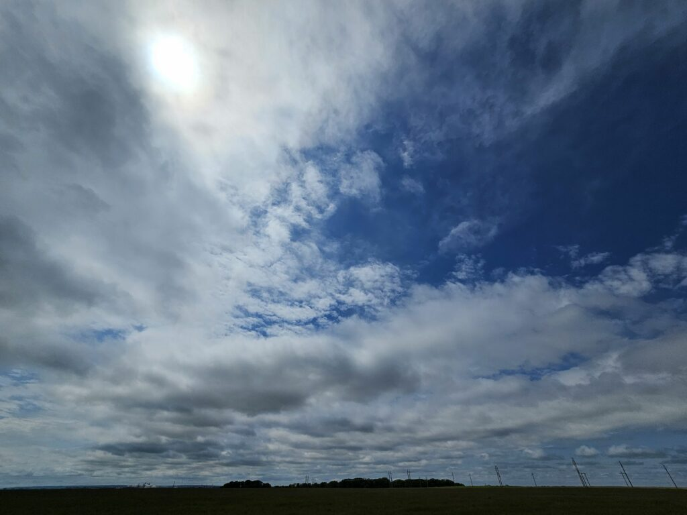
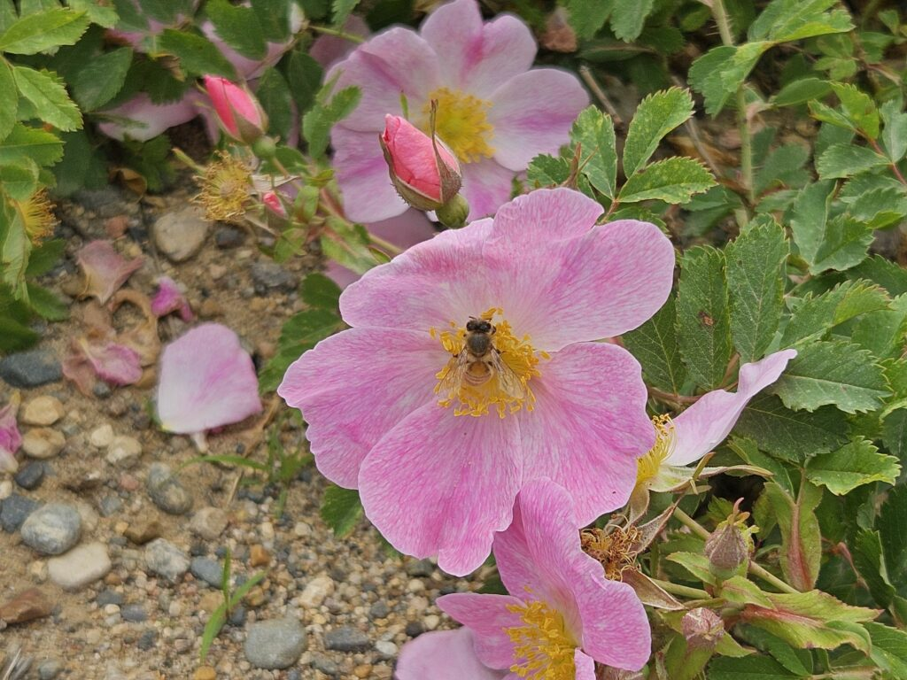
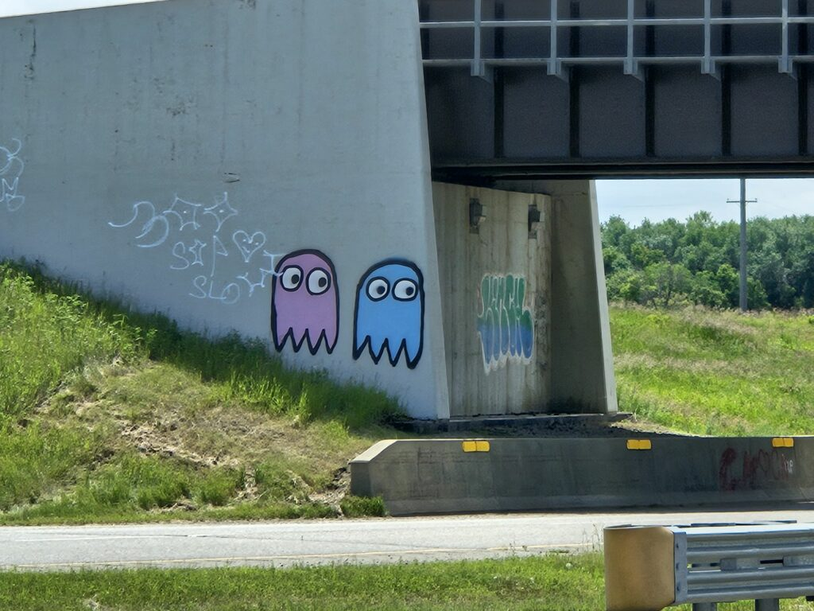

I hopped on my bike and went over 33km today—further than I meant to go, but the weather was lovely and I was feeling good. I wish I'd brought along a proper camera, but at least I had my phone((The best camera, as they say, is the one you have with you)).

