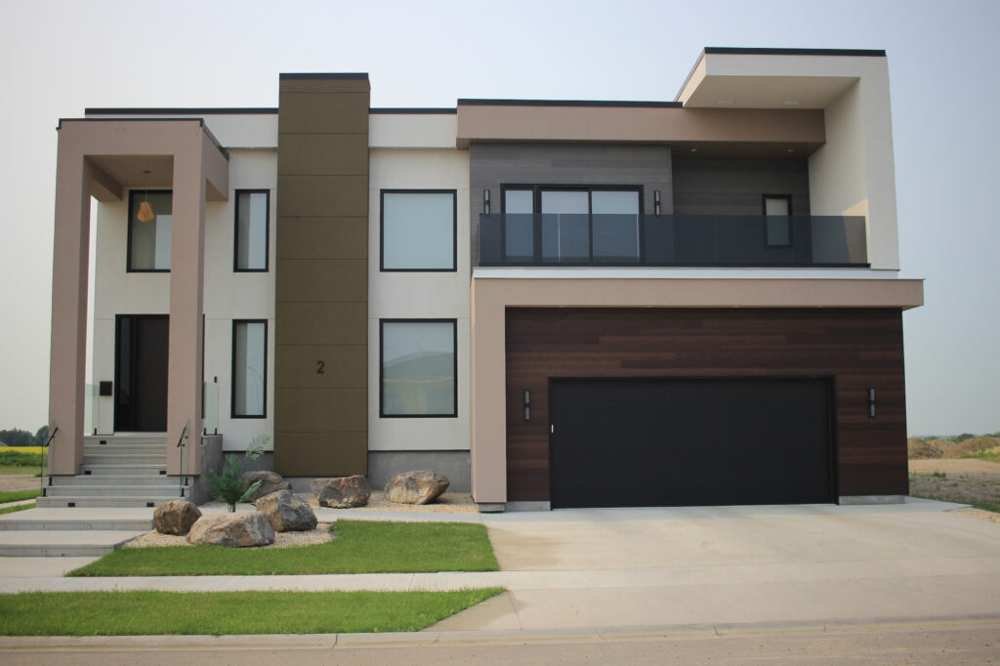
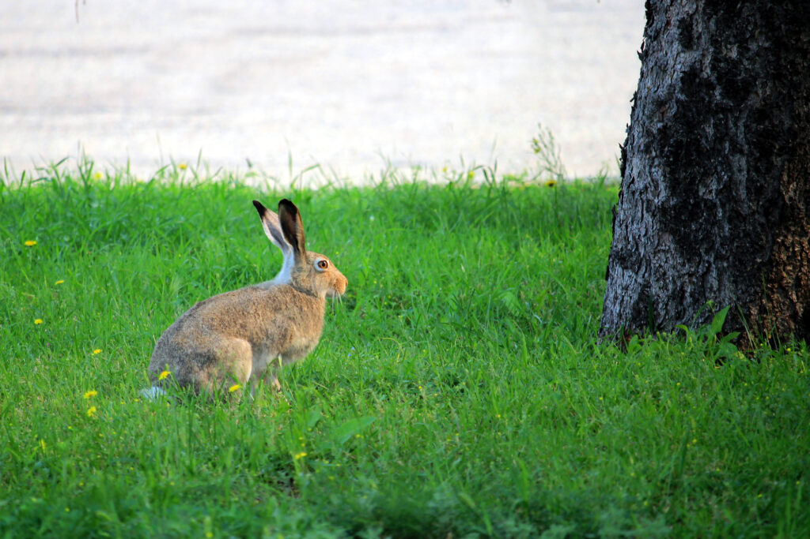

On July 20th, 2024, [Chez Angela](https://chezangela.ca/) held their second Biking Around the Whole City Biking Event of the City((I don't write the headlines, I just report them.)), and I set out to try and get myself a cookie. It was a hot one, but at least the ride started at 8:30 am when it was still only about 20°C((Even if it felt like 105% humidity.)).

I caught up with the Cookie Crew after about 17km, on the bike path along Richmond Ave. between 26th and 34th Streets. I got my cookie and—after posing for a brief "Good Morning!" video—a fetching tie-dyed T-shirt for Kathleen that says "I did it for the cookie".

Then I kept going, and saw a house that looks like it was made with Lego...

...and Hoss, the itinerant rabbit((Yes yes, I'm aware there's more than one rabbit in town, but it's easiest if we just name them _all_ "Hoss".)),((Short for "Hasenpfeffer".)).

Then I went home with over 30km under my belt. Good times. Good, sweaty times.
