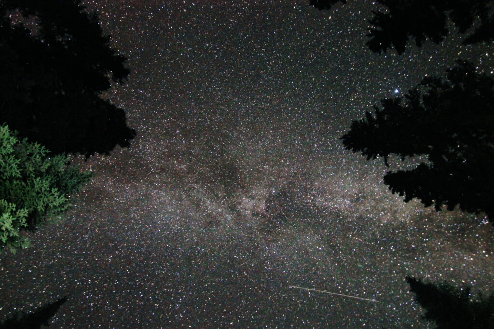

I went camping with some friends I've known for well over 30 years. As is my nature, I took my cameras and tripods, so in between the fishing, the drinks, the meals, the hikes, and the naps, I took a few photos.

<!--more-->

In no particular order:

