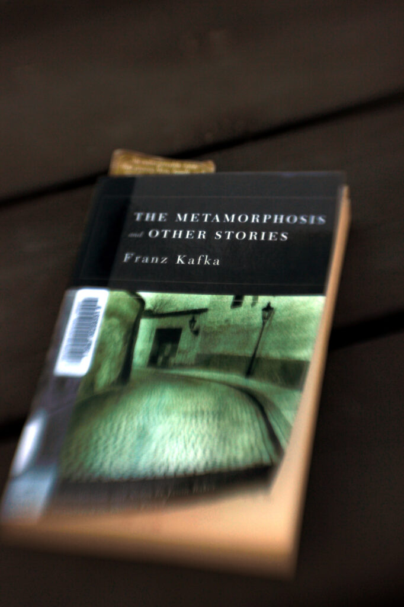
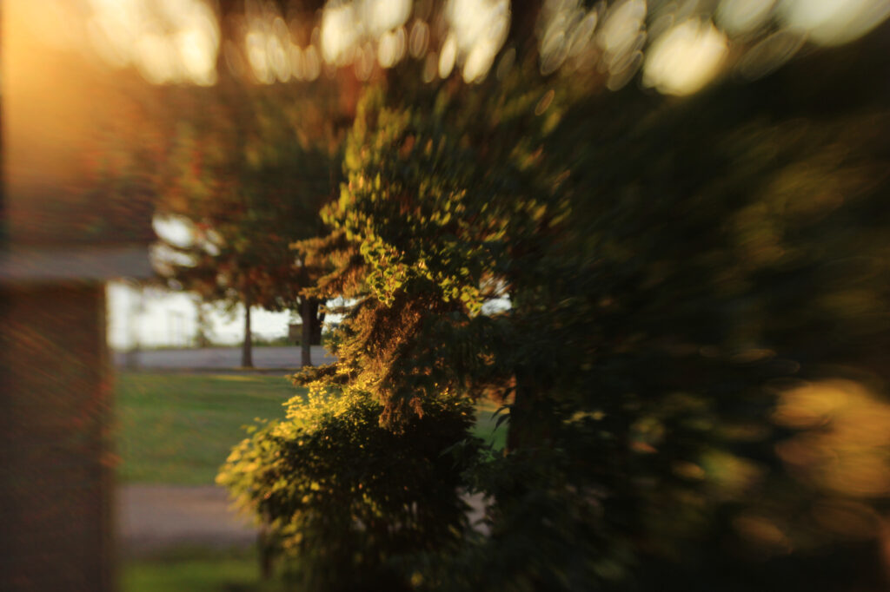

This morning, I went out to [Squirrel Hills](https://valleyliferec.ca/the-history-of-squirrel-hills/)—about 10 minutes' drive from the cabin; I could probably bike it—to watch a friend start off in a 40km race. After he was off, I took a few photos, since I'd never been to the Squirrel Hills before. It seems like a nice little place.

This evening, after supper, I pulled [my weird little Lensbaby lens](https://www.dpreview.com/articles/7296350649/lensbaby-2-0) out of its bag and snapped a few photos in the last hour or so of daylight.

In between, I worked on the outline of the story I'm working on this week, cleaning it up and refreshing my memory on the large-scale structure I'm hoping for. I think I even have an ending for it now, which is nice((The ending isn't necessarily nice, but it's nice to _have_ an ending, a target I can aim at.)).

And now, since the sky is clear and the forecast doesn't look promising for the rest of the week, I'm about to stay up late and try for some Milky Way photos. Don't wait up!
