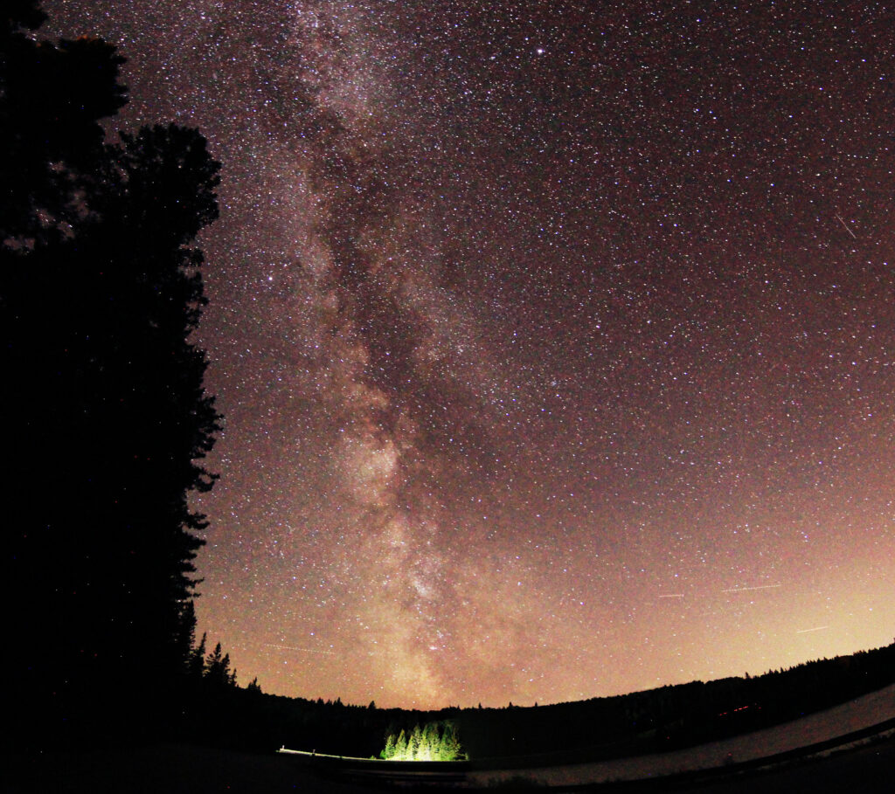
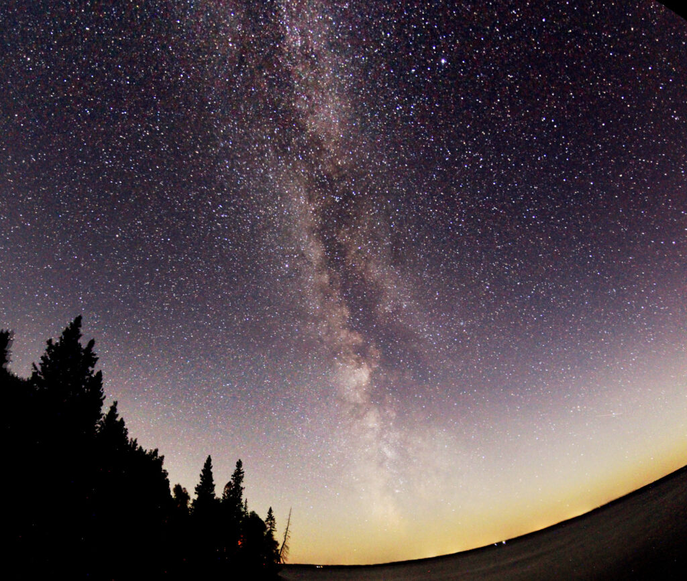
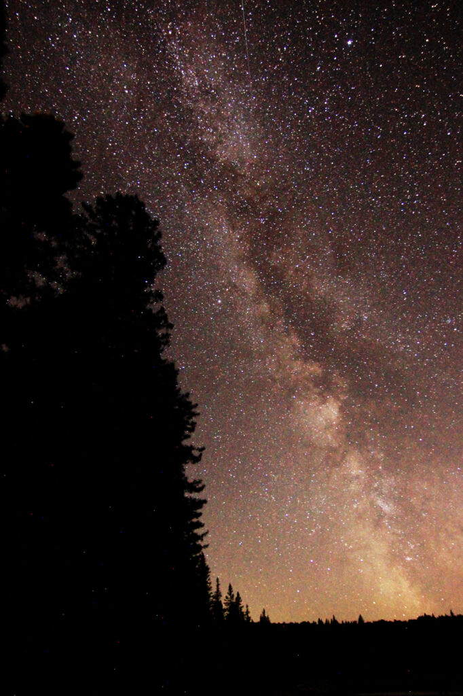

It was clear last night, so off I went to Riding Mountain to get some Milky Way photos. I shot a couple of panoramas, one just off the highway on the golf course / Wishing Well turnoff, the other at Spruces (thanks again, Tim!).

As I was leaving, thin clouds had started to roll in, and the moon—still half-full—was rising in the east.
