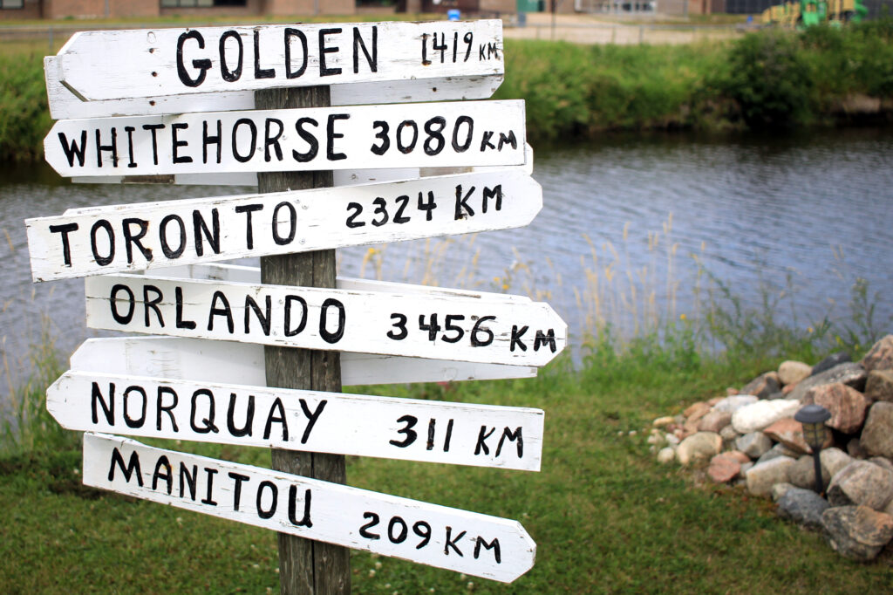

Yesterday's big thing was a 20-km bike ride. I took my camera along and snapped a couple photos; the bison up above and the signposts below, which reminded me of the Watson Lake signposts we saw on our trip, decades ago, to Yukon.

<figure>

<figcaption>

Interesting selection of locations

</figcaption>

</figure>

I also finished reading "The Metamorphosis", and it was, well, Kafkaesque((As you'd expect.)).

Today's plan: writing some sections of one of my stories; reading some _Bluebeard_ by Kurt Vonnegut (I'm about 5 chapters in and he's got some interesting things to say about art; I also wonder if Michael Swanwick lifted a few names((Like "Mintouchian" and "Gregorian".)) from the book for characters in his novel _Stations of the Tide_), and probably another bike ride, since the weather seems similar to yesterday. I need to inflate my bike's rear tire, though, before I go.

And if it's clear tonight, as the forecast suggests it should be, I think I'll gather up my cameras and tripods and go find a big, open sky with a Milky Way or other nighttime delights.
