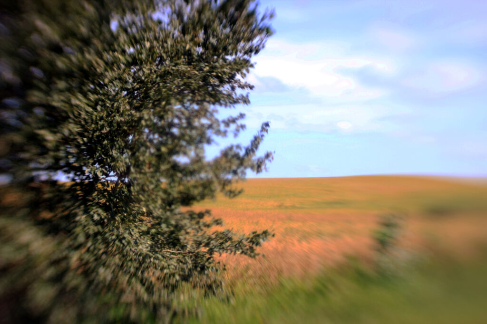
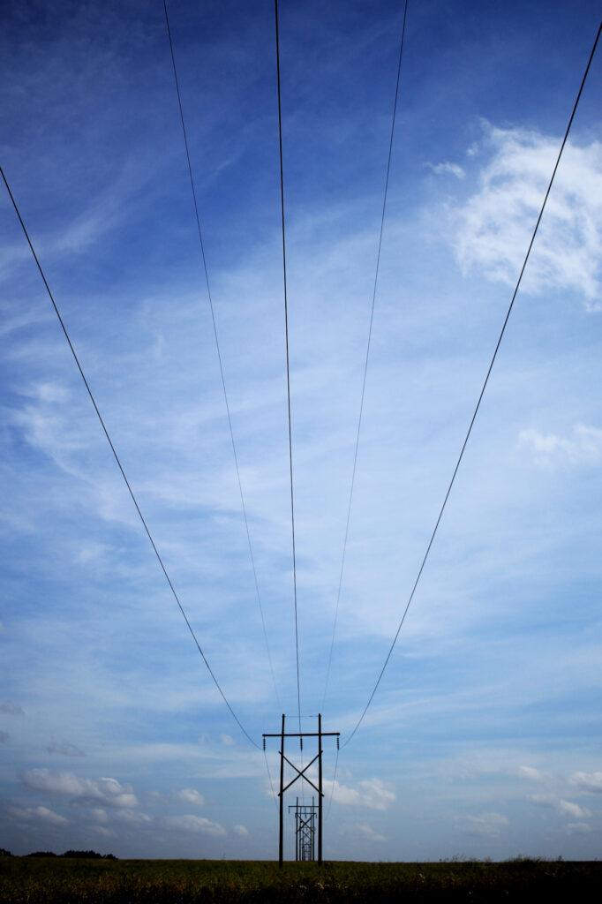
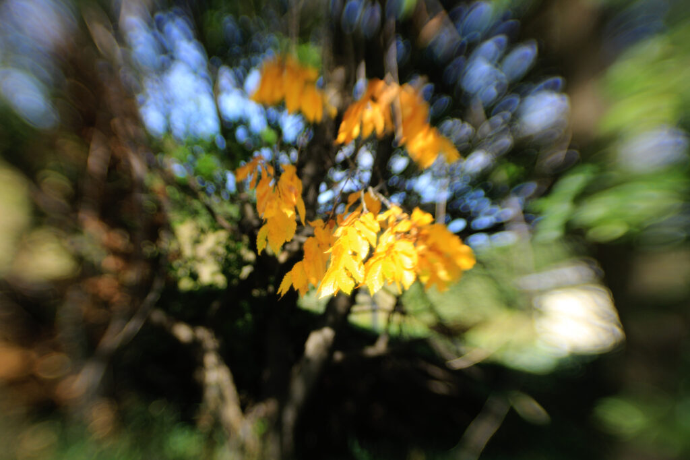

Another day, another bike ride. This was about 16km, and started at the coffee shop, where [I noticed I was that weirdo who wears a _Slaughterhouse-Five_ T-shirt but reads _Bluebeard_](https://mstdn.ca/@pjohanneson/113041504541285485).((A Vonnegut book is a Vonnegut book, though.))

Then I noodled around town for a bit, and out into the countryside, where I took photos of a tree...

<figure>

<figcaption>

ah, Lensbaby

</figcaption>

</figure>

...and some hydro lines.

<figure>

<figcaption>

power to the people

</figcaption>

</figure>

Then back into town, where I saw—

Look, I know some of you can't wait for Pumpkin Spice Cable-Knit Sweater time, but I'm not ready to let go of summer yet. So this little cluster of yellow leaves felt _particularly_ cruel, at least to me.

<figure>

<figcaption>

I'm not ready

</figcaption>

</figure>

Ah well. So it goes, as Kurt Vonnegut((Full circle.)) would say.
