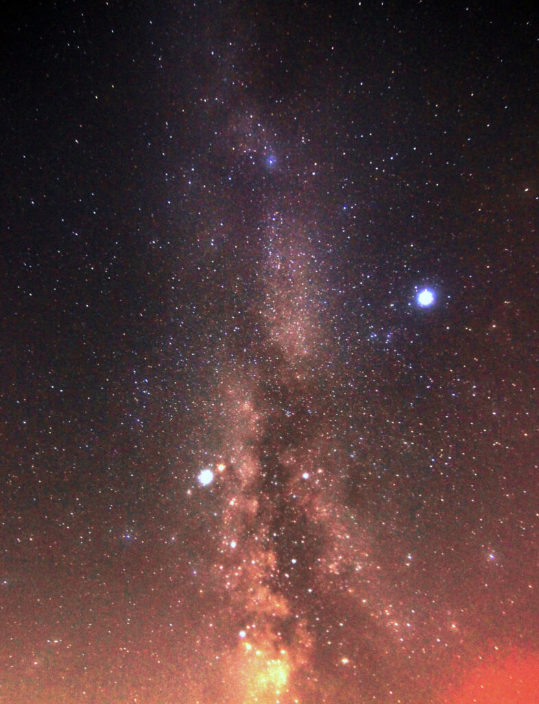
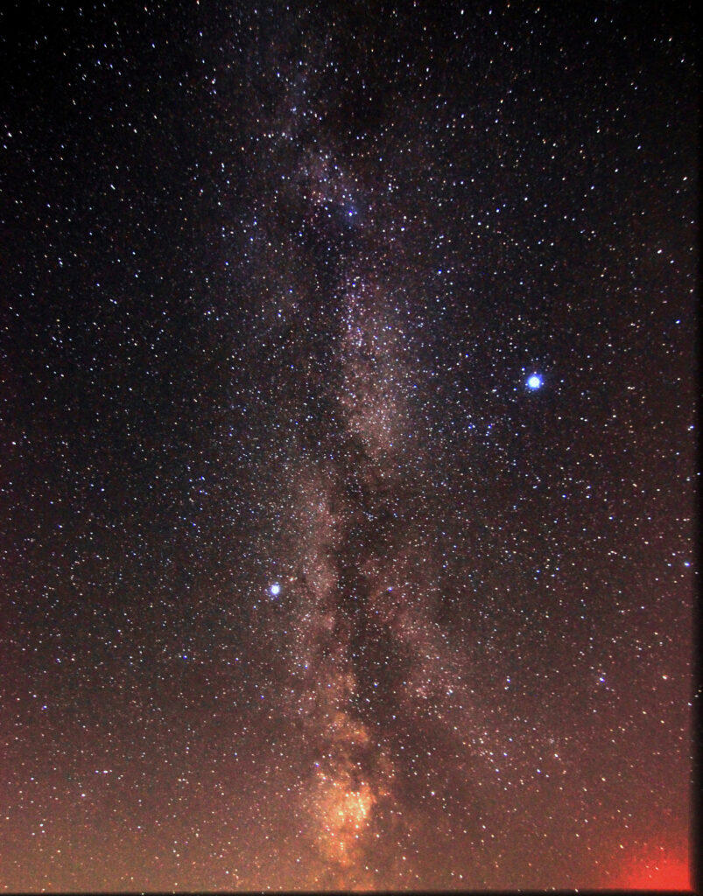
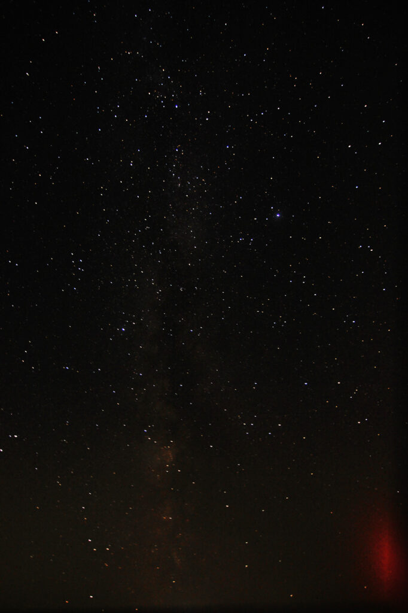

Last night I was settled in, ready to just watch a bit of TV and then go to bed, when my darling wife texted me:

> If the skies are as clear there as they are here, you need to go outside.

So I stepped out onto the patio and yes, yes it was pretty clear here. I gathered up my cameras and tripods and hit the road.

I set up on a gravel road not too far from town—if I want to, I could probably bike there—and snapped a few sets of Milky Way photos. With the 11-16mm lens, I was shooting ten-minute batches of 30 second frames, 11mm, _f_/2.8, with the ISO changing each ten minutes: 400, 800, and 1600. I wanted to see what I could get from the different ISO settings.

Unfortunately the dew crept onto my lens—or, more precisely, the UV filter I have screwed on over the lens. If I was smart, I'd have removed the filter and re-done my shooting; I think now it was the filter holding in a bit of heat that caused my dew problems.((Apparently the simple hack for dew is to wrap a couple hand warmers around the lens; you can hold them in place with tape or a beer cozy. Filed away for later experimentation.))

I managed to get two stacks from the ISO 1600 run, and they look pretty good, I think. One is 8 images deep, and the other is 10.

<figure>

<figcaption>

A little dew on the lens filter makes this a glamour shot

</figcaption>

</figure>

<figure>

<figcaption>

The image is fairly sharp, because I had just cleaned the dew off the lens filter

</figcaption>

</figure>

I also got a stack of 18 images from the ISO 400 run, and... Well, you can judge for yourself, but I think ISO 1600 is the sweet spot between "detail" and "noise" (at least for me). Maybe ISO 800 would work, if I can keep the lens from misting over...

<figure>

<figcaption>

It's quite a bit darker, even with double the images in the stack

</figcaption>

</figure>
