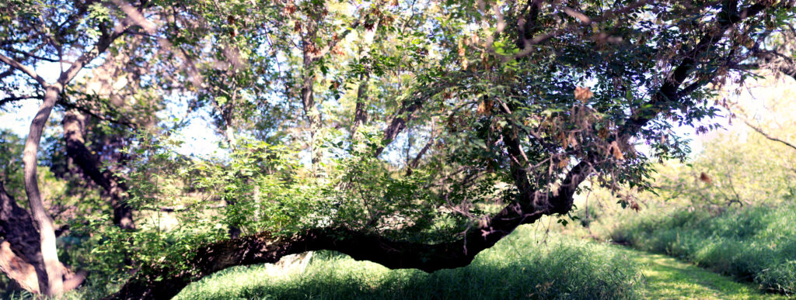
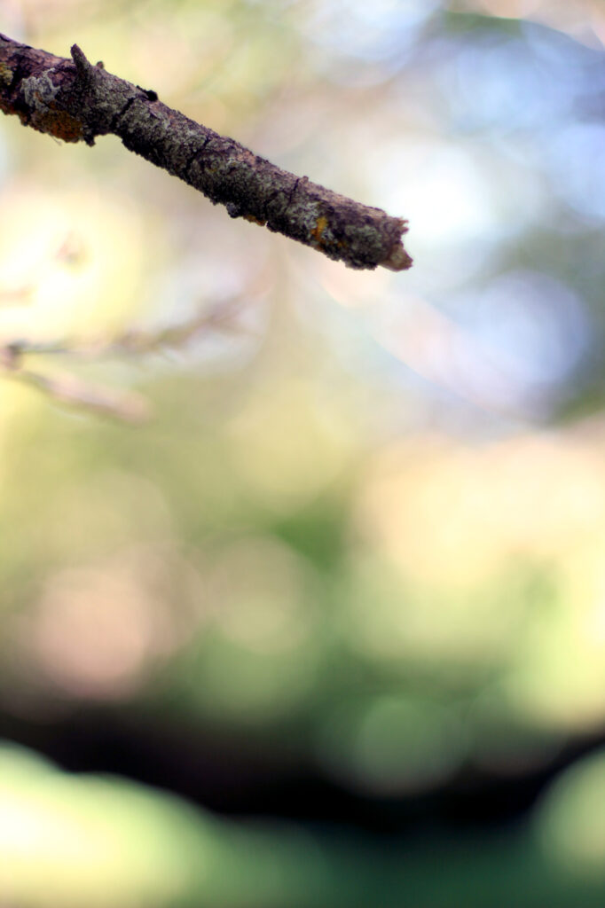

I went for a bike ride today, and got a couple of panoramas: one of the hillside to the north (above) and an interesting tree along the trail (below).

Then I cleaned up the cabin, packed, and headed home.

So how'd I do?

I deliberately didn't set myself any goals this year. I took my bike, my laptop, my cameras, and a bunch of books; this, I decided, would be a _vacation_ vacation, not—as it's kind of turned into over the years—a working vacation.

I read _Rules for a Knight_ by Ethan Hawke, a book I didn't know existed until Corey Redekop posted about finding it at a used book store; I read _Annihilator_ by Grant Morrison and Frazer Irving; and I read about ⅔ of Kurt Vonnegut's _Bluebeard_((And once this is posted, I'm probably going read some more.)). I wrote about 3000 new words, I think, in my "derelict starship" story. Since the cabin owner have Disney+, I watched a season of _The Mandalorian_. I took _a lot_ of photos.

It occurred to me, earlier today, that this "writing" retreat was really about 65% photography by weight, and I'm OK with that. Should I call it a "photography retreat"? An "art retreat"? Maybe, but I'm not going to. I'm the one writing these posts, after all, and I'll title them as I see fit.

Good night, and good luck.

