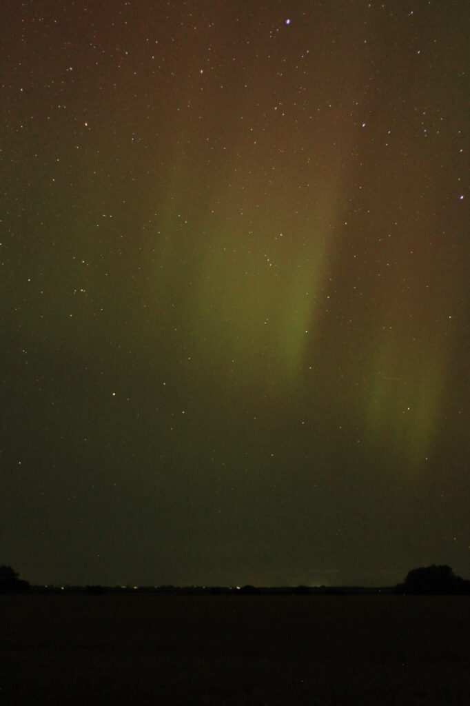

It was quite a night.

<!--more-->

<figure>

https://vimeo.com/1003717434

<figcaption>

see if you can spot where I wiped the dew off the lens

</figcaption>

</figure>

(I'm impressed how well that top panorama turned out; normally my panorama program balks at trying to stitch together photos of the aurora.)
