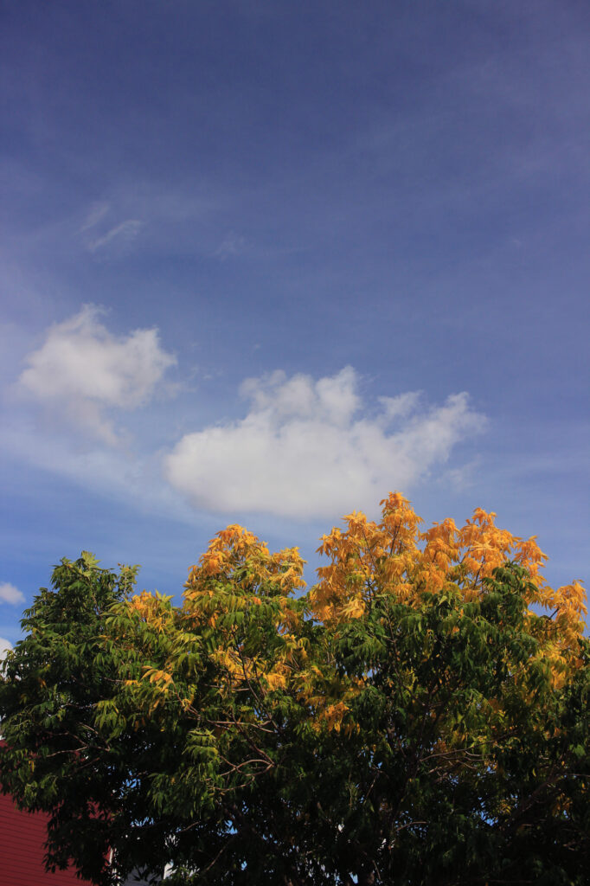
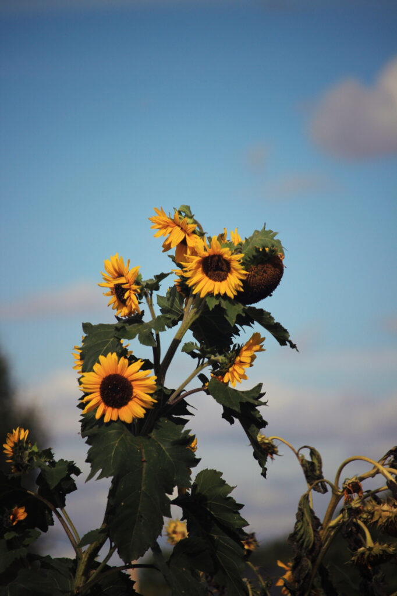

I took my camera on today's ride and snapped a few photos, all, apparently, of plants.

This tree stands in for a 1,000-word story about how I'm not ready for autumn to be here, but it is implacably here nonetheless.

There were quite a few sunflowers planted at the community gardens this year. This one was being particularly photogenic today. Someone, though, has removed the Ukrainian flag that used to fly there, and I'm not sure why.
