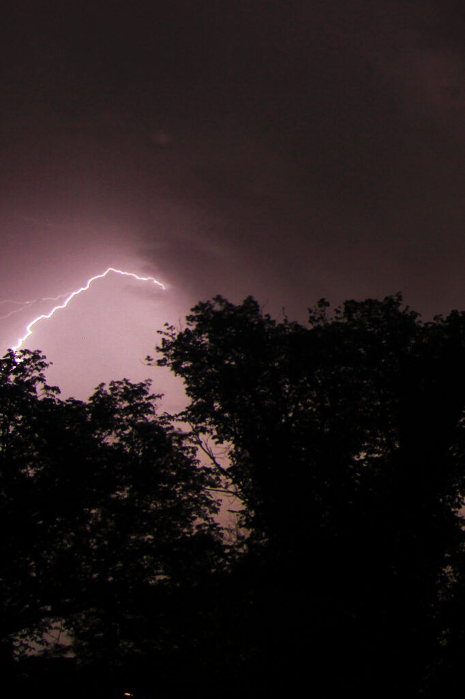
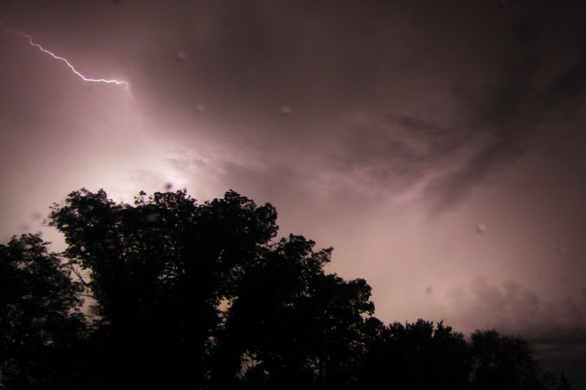
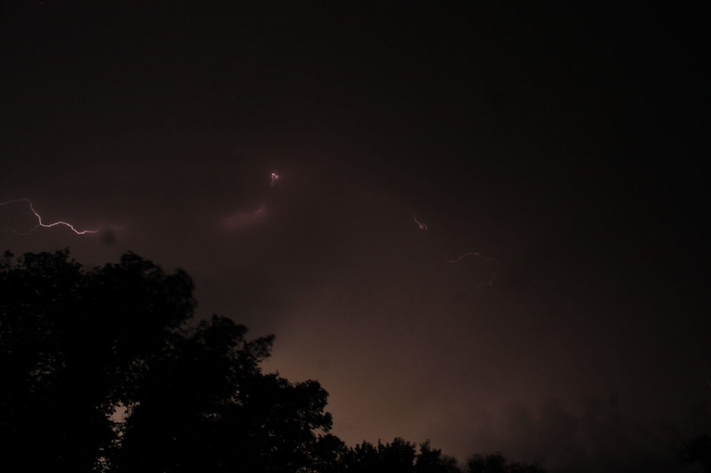
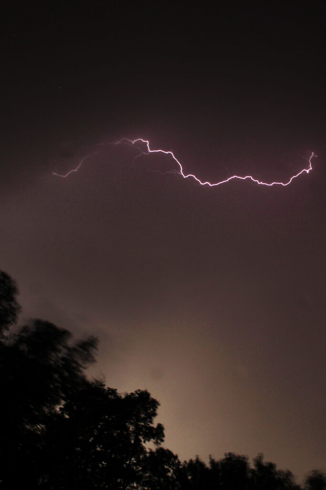
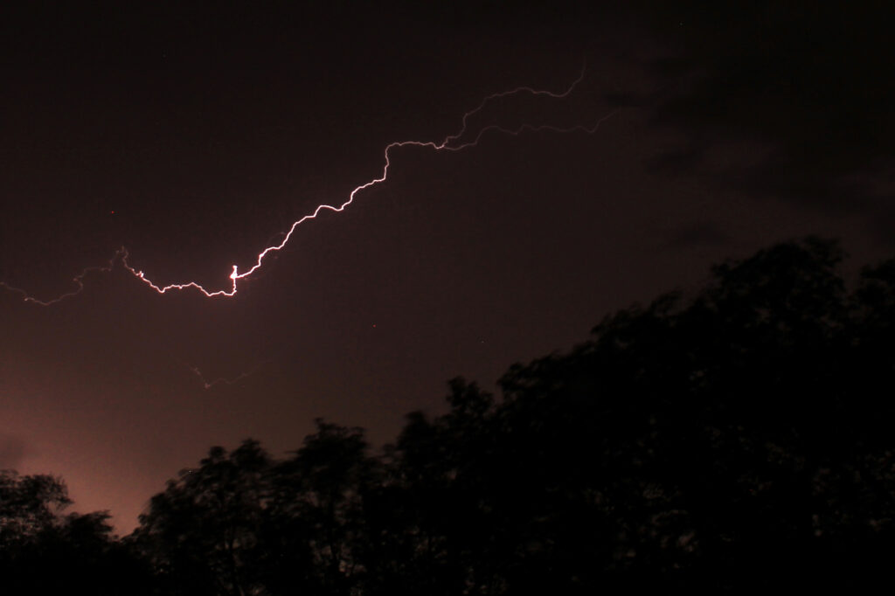

There was quite the lightning show from a storm passing through. I set up a tripod in the upstairs bedroom, and it was bright enough, sustained enough, that I was able to check my focus ring just by the light from the storm.

It was especially impressive to realize the heart of the storm actually passed just to the east of us; we caught the very edge of it.
