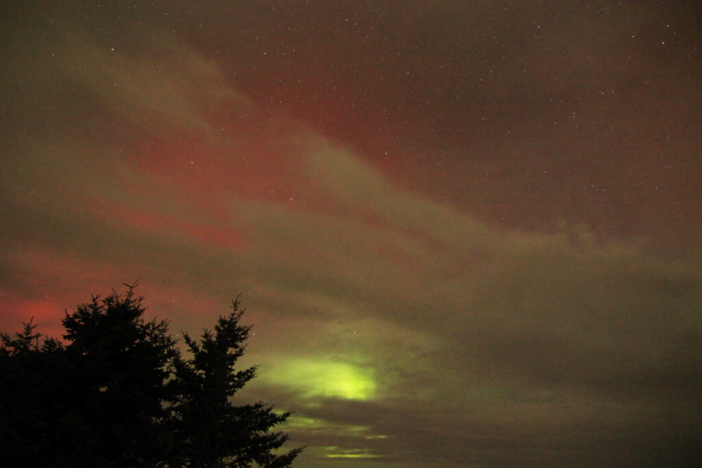
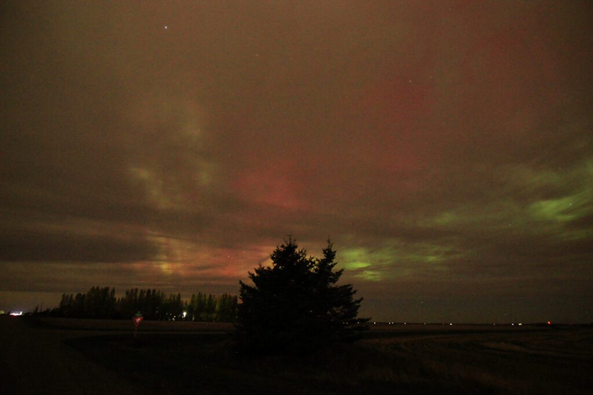
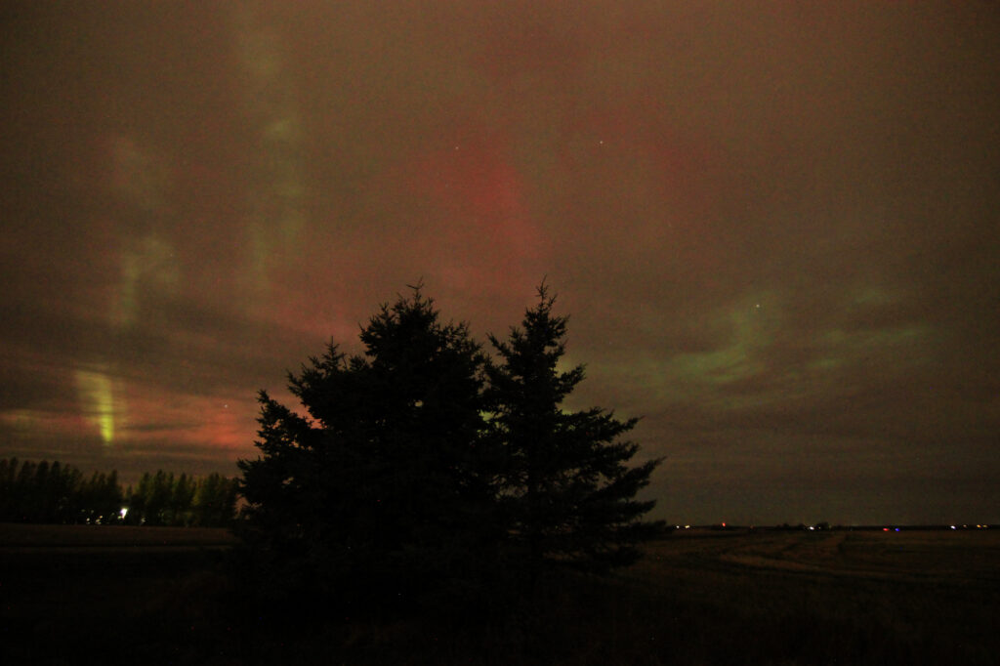
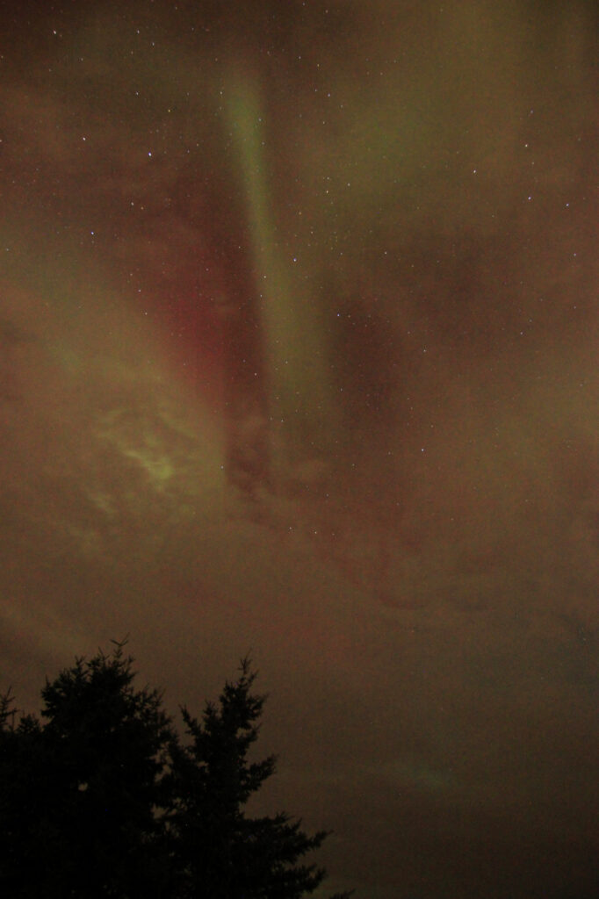
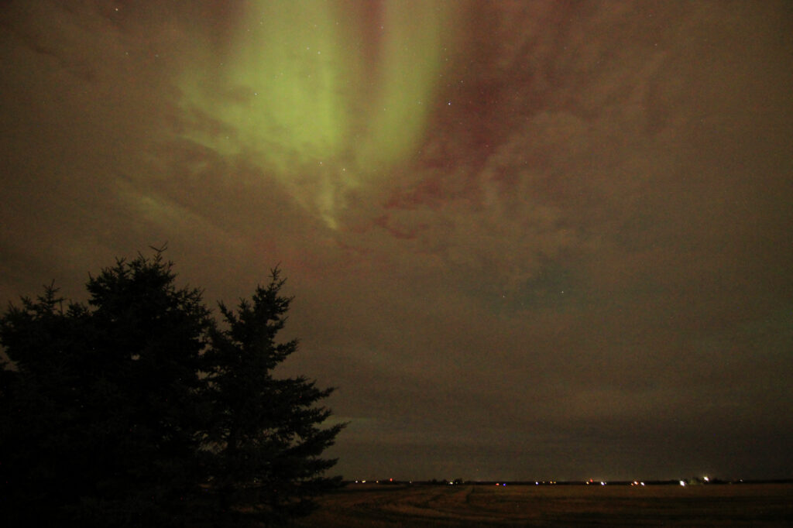
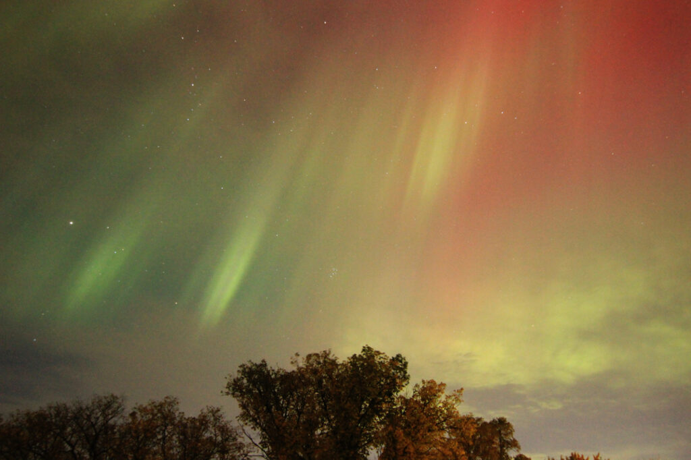

It was clear to the west, so I grabbed my camera and took a chance.

It was _not_ clear to the north.

Once I got home, the sky to the east was clear. I set up a camera in our spare room, aimed due east, and let it click until the batteries died. Between 11:30pm and 2:30am it got these gems, plucked from almost 2000 frames.

These photos, I have to keep reminding myself, were taken _inside the city_. Normally I'm happy when I get light like this a few kilometres out of town, where it's starting to get properly dark. These aurora were competing with streetlights, and winning.

Oh yeah, I also turned the 2000ish photos from the spare room into a timelapse.

https://vimeo.com/1018676477
