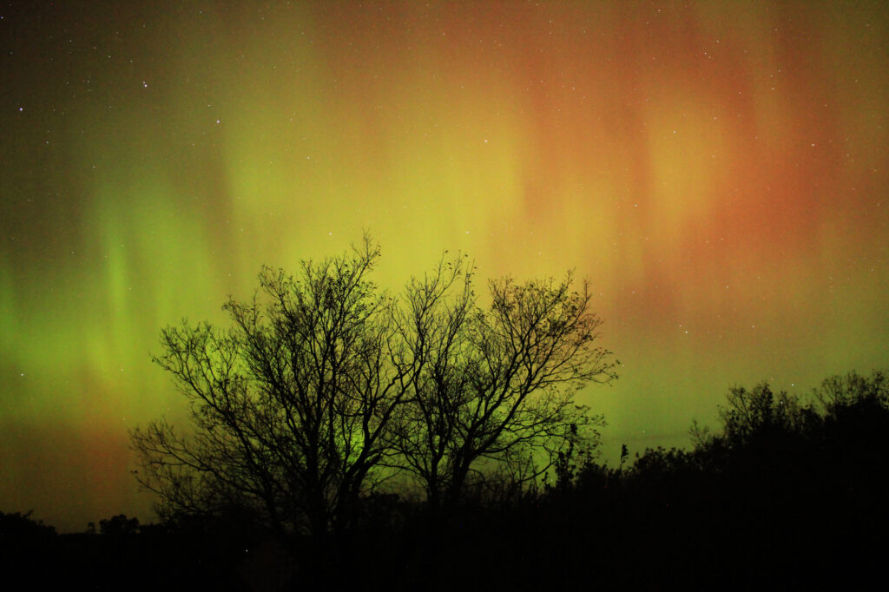
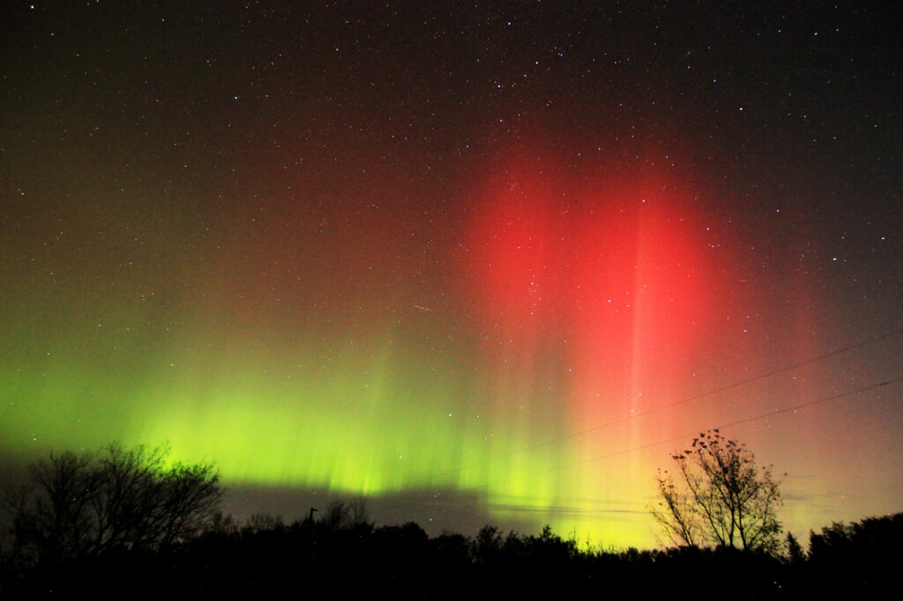

Were the northern lights out last night? Yes.

Was I out last night? Also yes.

<!--more-->

[Apparently the red colour is a sign of an intense storm.](https://www.space.com/aurora-colors-explained) That makes sense, because as I recall, the solar flare that launched this CME Earthward was a pretty powerful one.

https://vimeo.com/1017350975

Also, since it was dark enough for the galaxy to be faintly visible, I snapped a couple 10-image sets for later stacking. I think they turned out OK. I might need to learn what a flat frame and a bias frame is, but that's a problem for another day.

Finally, here's a view of how little post-processing I had to do on these photos.

<figure>

<figcaption>

left: straight out of camera; right: processed

</figcaption>

</figure>

<figure>

<figcaption>

left: roughly what my eyes see; right: what the camera captures

</figcaption>

</figure>
