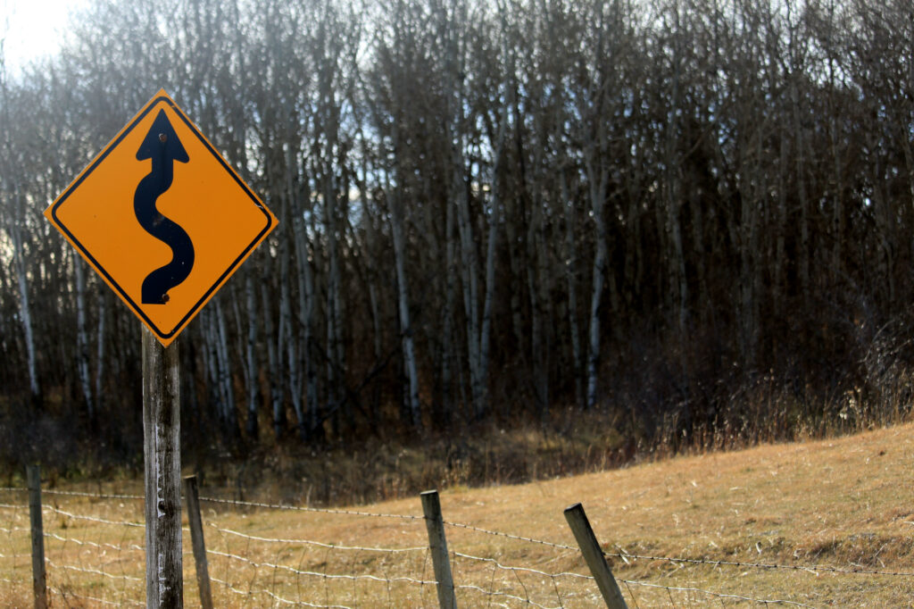
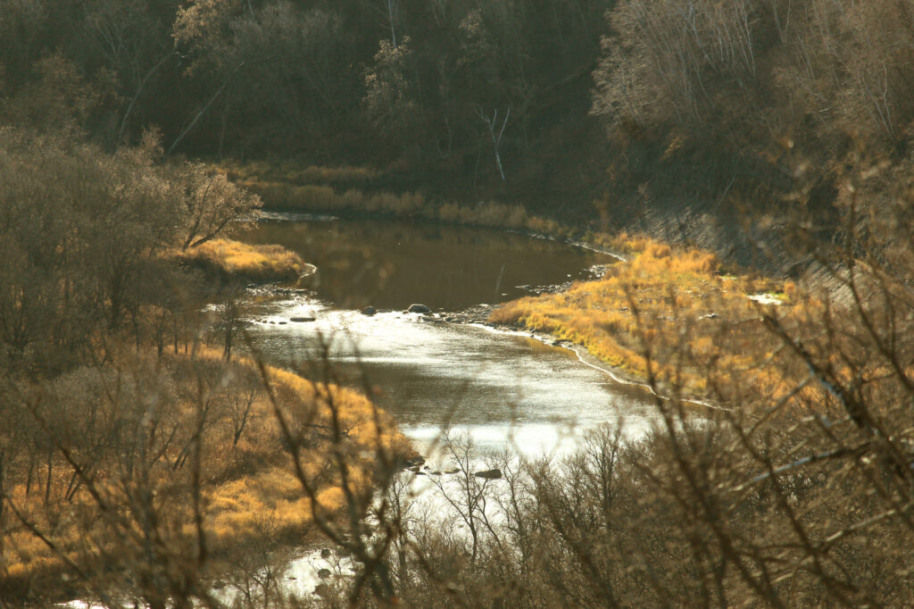
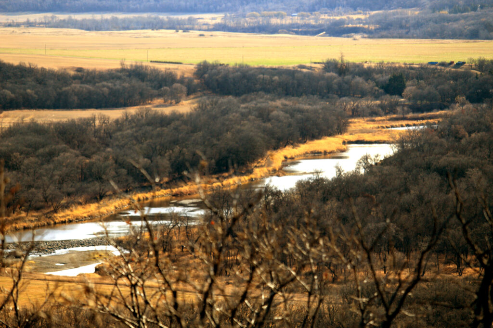
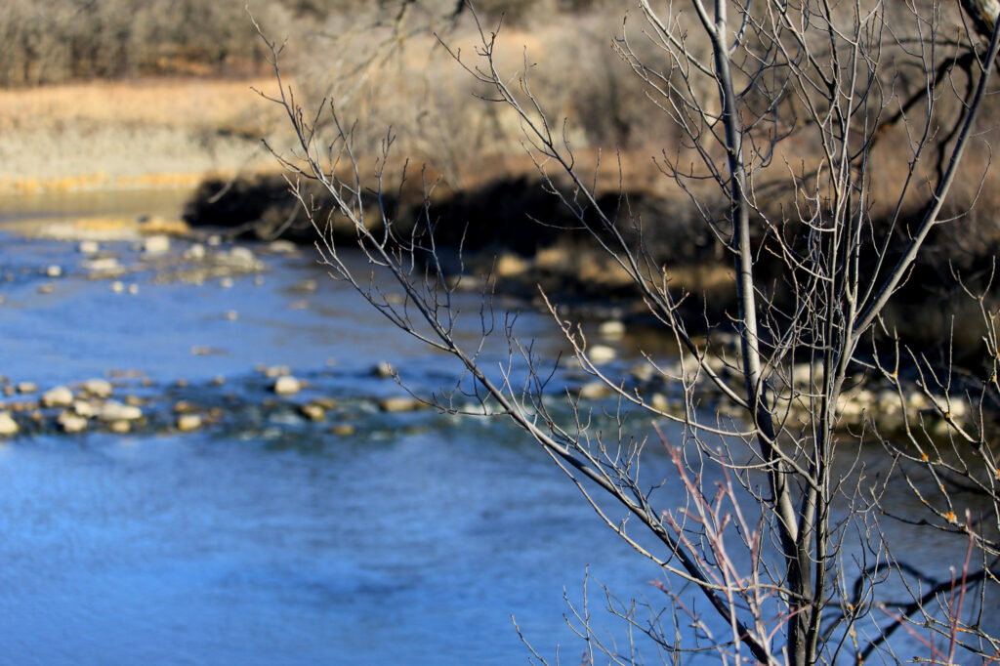
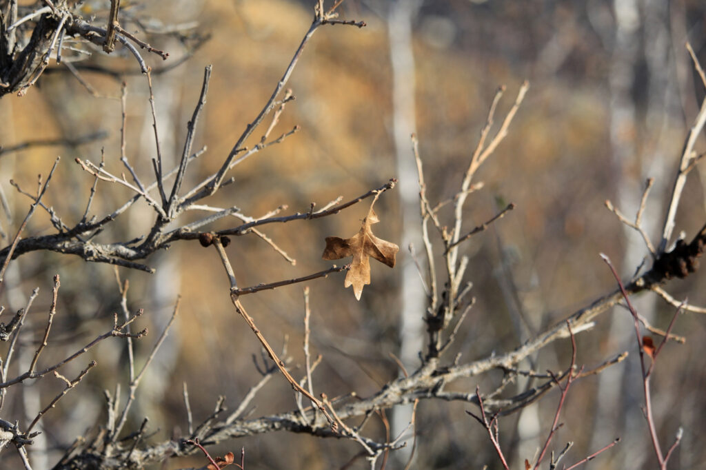
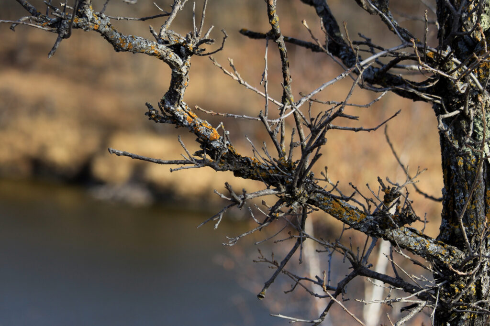
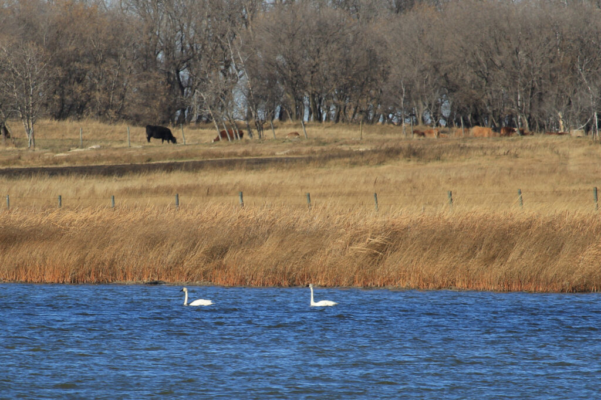
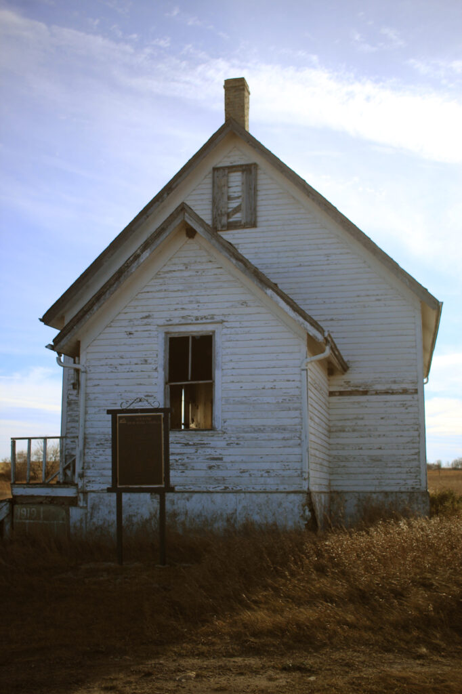
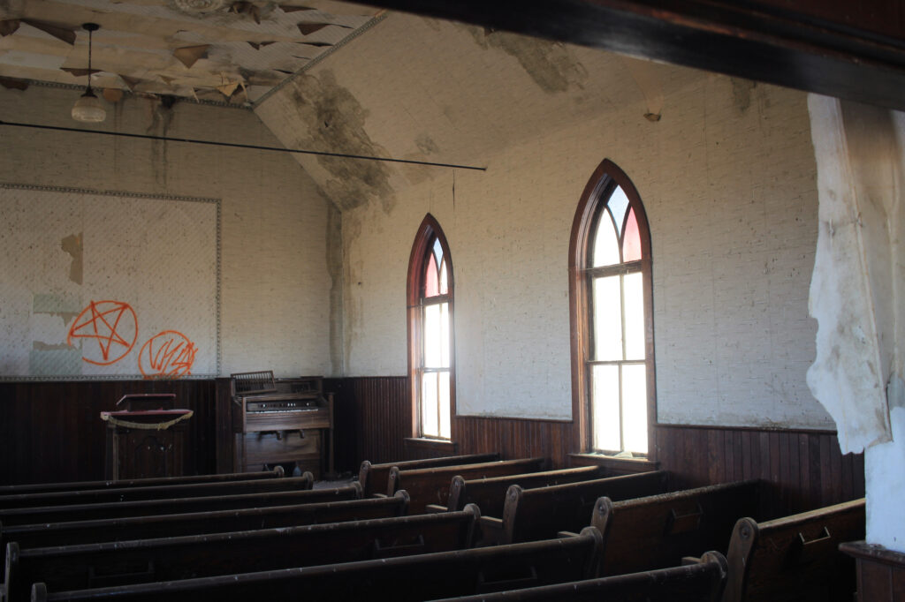
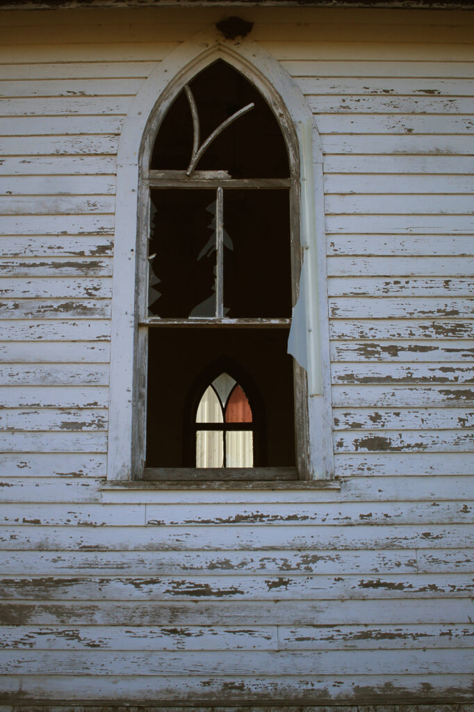

My friend Kelly talked me into going for a bike ride in the Souris Valley today, in a wildlife management area. He wasn't sure how many hills there were((There were _lots_.)) but he was pretty sure there'd be some great views((There were.)).

<!--more-->

